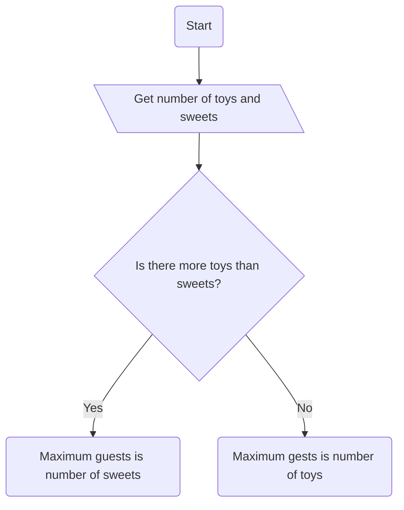

```mermaid
    flowchart TD
    A(Start) --> B[\Get number of toys and sweets\]
    B --> C{Is there more toys than sweets?}
    C --> |Yes| D(Maximum guests is number of sweets)
    C --> |No| E(Maximum gests is number of toys)
```