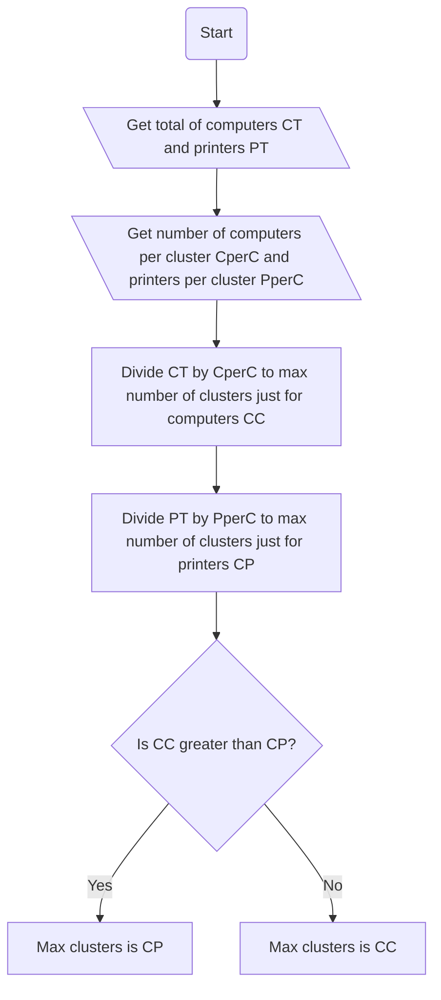

```mermaid
    flowchart TD
    A(Start) --> B[\Get total of computers CT and printers PT\]
    B --> C[\Get number of computers per cluster CperC and printers per cluster PperC\]
    C --> D[Divide CT by CperC to max number of clusters just for computers CC]
    D --> F[Divide PT by PperC to max number of clusters just for printers CP]
    F --> G{Is CC greater than CP?}
    G --> |Yes| H[Max clusters is CP]
    G --> |No| I[Max clusters is CC]
```