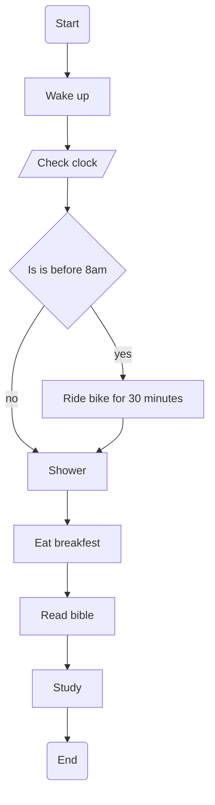

```mermaid
flowchart TD
    A(Start) --> B[Wake up]
    B --> C[/Check clock/]
    C --> D{Is is before 8am}
    D --> |yes| E[Ride bike for 30 minutes]
    D --> |no| F[Shower]
    E --> F
    F --> G[Eat breakfest]
    G --> H[Read bible]
    H --> I[Study]
    I --> J(End)
```